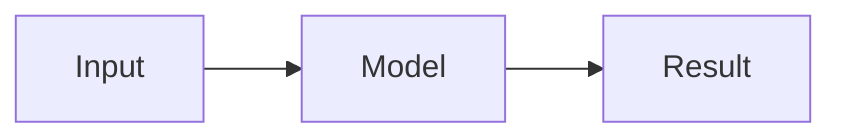

# Ilesh Dhall — Portfolio

A personal portfolio and research website for **Ilesh Dhall**, featuring projects, publications, achievements, detailed Markdown pages, and downloadable CV/resume documents.

Built with Next.js, TypeScript, Tailwind CSS, TOML, Markdown, and BibTeX. The website exports to plain static files, so it can be deployed on GitHub Pages, Cloudflare Pages, or any static host.

## Features

- Responsive light and dark themes
- Content-first editing with TOML, Markdown, and BibTeX
- Project cards with repository, demo, paper, and blog badges
- Markdown project and publication detail pages with tables, math, syntax highlighting, and Mermaid diagrams
- Searchable and filterable publications
- Achievement timeline with organization logos and external links
- Static export for straightforward, low-maintenance deployment

## Getting started

### Requirements

- Node.js 22 or newer
- npm

### Run locally

```bash
npm install
npm run dev
```

Visit [http://localhost:3000](http://localhost:3000).

### Verify a production build

```bash
npm run build
```

The deployable static website is created in `out/`.

## Content guide

Most updates only require editing files in `content/` and adding assets under `public/`.

```text
content/
├── config.toml            Site identity, navigation, social links, footer date
├── about.toml             About-page section configuration
├── bio.md                 About-page biography
├── highlights.toml        About-page highlights
├── projects.toml          Project cards
├── projects/              Project detail Markdown files
├── publications.toml      Publications-page configuration
├── publications.bib       Publication records
├── papers/                Publication detail Markdown files
└── awards.toml            Achievement entries

public/
├── projects/              Project images
├── papers/                Publication images
├── logos/                 Organization logos
└── Ilesh_Dhall_*.pdf      Resume and CV
```

### Site settings and navigation

Edit `content/config.toml` for your name, social links, navigation, avatar, and footer date.

```toml
[site]
title = "Ilesh Dhall"
last_updated = "August 24, 2026"

[social]
github = "https://github.com/Ilesh-Dhall"
linkedin = "https://www.linkedin.com/in/ilesh-dhall/"
```

`last_updated` is intentionally manual: update it when you publish a meaningful site change.

### Add a project

Add an entry to `content/projects.toml`.

```toml
[[items]]
slug = "my-project"
title = "My Project"
author = "Ilesh Dhall"
show_author = true
subtitle = "A concise project subtitle"
date = "2026"
image = "/projects/my-project/cover.png"
content = "Short summary shown on the project card."
details_source = "projects/my-project.md"
show_detail_page = true
show_contents = true
tags = ["Next.js", "TypeScript"]

[[items.links]]
label = "GitHub"
url = "https://github.com/<username>/<repository>"

[[items.links]]
label = "Live Demo"
url = "https://example.com"
```

Place the detail page at `content/projects/my-project.md`. Headings beginning with `##` are used by the optional contents navigation.

Use `show_author = true` only when the author line should appear on the card. A detail page is created only when `show_detail_page = true`.

### Add a publication

Add a BibTeX record to `content/publications.bib`.

```bibtex
@inproceedings{my-paper,
  title = {My Paper Title},
  author = {Dhall, Ilesh and Coauthor, Name},
  booktitle = {Conference Name},
  year = {2026},
  doi = {10.xxxx/example},
  code = {https://github.com/<username>/<repository>},
  details_source = {papers/my-paper.md},
  show_contents = {true}
}
```

Optional fields include `preview`, `description`, `abstract`, `url`, `code`, `pdf`, `details`, and `details_source`. Omit `year` if it is unknown; the site will leave it blank rather than inventing a year.

### Add an achievement

Add an item to `content/awards.toml`.

```toml
[[items]]
title = "Achievement title"
symbol = "trophy"
date = "August 2026"
content = "A short description of the recognition."
link = "https://certificate-or-linkedin-post.example"

[[items.organizations]]
name = "Organization name"
icon = "/logos/organization.png"
link = "https://organization.example"
```

Use multiple `[[items.organizations]]` blocks for a shared achievement. They are displayed with logo/name pairs separated by a dot. Available tile symbols are `academic-cap`, `document`, `microscope`, `trophy`, and `users`.

### Write Markdown pages

Markdown supports standard formatting, GFM tables, LaTeX math, code blocks, images, and Mermaid diagrams.

````markdown

````

Store an image in `public/` and reference it with an absolute public path:

```markdown

```

## Deployment

Static export is enabled in `next.config.ts`; do not remove `output: 'export'`, `trailingSlash: true`, or `images.unoptimized`.

### GitHub Pages

1. Create a GitHub repository and initialize this folder with your own history:

   ```bash
   git init
   git add .
   git commit -m "Initial portfolio"
   git branch -M main
   git remote add origin https://github.com/<username>/<repository>.git
   git push -u origin main
   ```

2. In GitHub, go to **Settings → Pages** and choose **GitHub Actions** as the source.
3. Open the **Actions** tab and run **Deploy portfolio to GitHub Pages**.
4. To deploy automatically after every push, uncomment the `push` section in `.github/workflows/deploy.yml`.

If the repository is not named `<username>.github.io`, set `basePath` and `assetPrefix` in `next.config.ts` as explained in [docs/deployment.md](docs/deployment.md).

### Cloudflare Pages

Create a Pages project, connect the repository, and set:

- Build command: `npm run build`
- Build output directory: `out`
- Node.js version: `22`

The full deployment reference is available in [docs/deployment.md](docs/deployment.md).

## License and attribution

Licensed under the [MIT License](LICENSE). This portfolio was originally built from the [PRISM](https://github.com/xyjoey/PRISM) template and has been substantially customized.
