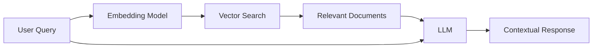
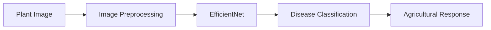

AgriVerse is an AI-powered agricultural advisory platform designed to bring together information from multiple agricultural domains through a unified multi-agent system.

The platform combines **domain-specific AI agents, retrieval-augmented generation, real-time data integration, computer vision, and workflow orchestration** to provide contextual agricultural assistance. Agents handle weather and geolocation, market prices, crop-related queries, and policy and financial information, while a dedicated EfficientNet model provides plant disease classification.

The system is implemented as a full-stack application with a FastAPI backend, React frontend, ChromaDB vector stores, and n8n-based workflow orchestration.

## Motivation

Agricultural information is often fragmented across different sources. Weather conditions, commodity prices, crop knowledge, government schemes, and plant health information may each require separate tools or services.

A conversational agricultural assistant therefore needs more than a general-purpose language model. Some queries require **real-time information**, others require **domain-specific retrieval**, while tasks such as disease detection require a dedicated machine learning model.

The central goal of AgriVerse was:

> **To explore how multiple specialized AI capabilities can be orchestrated into a single agricultural intelligence system.**

Rather than relying on one model for every task, AgriVerse separates reasoning, retrieval, external data access, and specialized inference into distinct components.

## System Architecture

AgriVerse uses an orchestrator-based multi-agent architecture. A user query is first interpreted by the orchestrator, which delegates the request to the appropriate domain-specific agents.

The architecture allows individual agents to use the most appropriate source of information or computational capability for a given request.

## Multi-Agent Intelligence

The core of AgriVerse is a collection of specialized agents coordinated through an **orchestrator**.

The platform includes agents for:

- **Weather and geolocation**
- **Market and commodity prices**
- **Crop and agricultural assistance**
- **Policy and financial assistance**

This separation allows different types of queries to follow different information paths.

For example, a crop-related question can be answered using retrieved agricultural knowledge, while a weather-related query can access current external data. A more complex query can combine information from multiple agents before producing a unified response.

## Retrieval-Augmented Generation

AgriVerse uses **retrieval-augmented generation (RAG)** for domain-specific knowledge.

Agricultural and financial information is stored in **ChromaDB** vector databases, with **HuggingFace embeddings** used for semantic retrieval.

Instead of relying entirely on knowledge encoded in the language model, relevant documents can first be retrieved from the corresponding knowledge base and supplied as context.

This provides the model with more specific information for agricultural and policy-related questions.

## Real-Time Data Integration

Some agricultural queries depend on information that changes over time.

AgriVerse therefore integrates external data sources through specialized agents.

The weather and geolocation agent can access **OpenWeatherMap** and government data sources, while the market-price agent retrieves commodity-related information through dedicated market interfaces.

This creates a distinction between:

- **Retrieved domain knowledge**, which comes from vector databases
- **Real-time information**, which comes from external APIs
- **Model-generated reasoning**, which combines the available information into a response

This separation is important for applications where current information is essential.

## Plant Disease Classification

AgriVerse also includes a computer vision component for plant disease detection.

The disease-classification workflow uses a **PyTorch-based EfficientNet model** to analyze plant images and predict disease classes.

The custom disease-classification model achieved an **F1 score of 94.4%** on the evaluated task.

Rather than operating as a completely separate application, the model is integrated into the broader agricultural assistance workflow, allowing visual disease information to become another input to the system.

## Workflow Orchestration

The different AI capabilities are connected using **n8n** workflows.

The repository includes multiple workflow configurations:

- **Gemini workflow** for image and text-based agricultural queries
- **Groq workflow** using Llama 4 Scout for image and text-based queries
- **Disease workflow** combining the custom EfficientNet classifier with general agricultural assistance

This workflow-oriented architecture makes it possible to change individual components without redesigning the entire application.

It also provides a practical way to connect language models, APIs, retrieval systems, and specialized machine learning models within a single application.

## System Implementation

The platform is organized into separate frontend, backend, and workflow components.

### Backend

The backend uses **FastAPI** and hosts the application services, vector databases, and machine learning models.

The backend includes:

- ChromaDB vector stores
- Agricultural and financial knowledge bases
- PyTorch models
- API services
- Agent-related functionality

### Frontend

The frontend is implemented using **React with Vite**, with **TailwindCSS** and **shadcn/ui** for the interface.

It provides the user-facing conversational interface for interacting with the underlying agents and services.

### Orchestration

The `workflows` directory contains the n8n workflows used to connect the LLMs, retrieval systems, external APIs, and specialized models.

The complete system can also be containerized using **Docker Compose**, allowing the major components to be deployed together.

## Discussion

AgriVerse demonstrates how a domain-specific AI application can be built by combining several complementary capabilities rather than relying on a single language model.

The main architectural idea is the separation of **reasoning, retrieval, real-time data, and specialized inference**.

Language models provide the conversational reasoning layer, vector databases provide domain-specific context, external APIs provide changing information, and the EfficientNet model handles image-based disease classification.

This modular design allows individual components to be improved or replaced independently.

At the same time, multi-agent systems introduce engineering challenges around query routing, context management, API integration, latency, and reliability. These considerations become increasingly important when moving from a prototype toward a production-scale agricultural assistant.

## Conclusion

AgriVerse explores a **multi-agent architecture for agricultural intelligence** that combines conversational AI with retrieval systems, real-time data sources, computer vision, and workflow orchestration.

The platform integrates specialized agents for weather, markets, agricultural knowledge, and policy information with ChromaDB-based retrieval and an EfficientNet disease-classification model.

By combining these capabilities behind a unified interface, AgriVerse demonstrates how domain-specific AI systems can move beyond a standalone language model and instead use **specialized tools, retrieved knowledge, external data, and machine learning models as coordinated components of a larger system**.
