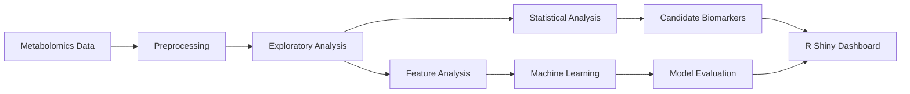

# Abstract

Metabolomics provides a way to characterize biological systems by measuring changes in metabolite abundance across experimental conditions. This project explores the use of metabolomics data for **biomarker discovery in drug-induced cardiotoxicity**, combining statistical analysis, exploratory visualization, and machine learning.

Using targeted metabolomics measurements from human-induced pluripotent stem cell-derived cardiomyocytes (hiPSC-CMs), the analysis investigates metabolic patterns associated with cardiotoxic responses and evaluates whether these patterns can be used to distinguish cardiotoxic from non-cardiotoxic samples.

A **Random Forest** classifier achieved **91.55% accuracy**, **91.03% balanced accuracy**, **89.30% F1-score**, and **0.9552 PR AUC** on the evaluated dataset. An interactive **R Shiny dashboard** was also developed to make the analysis and results easier to explore.

## Motivation

Drug-induced cardiotoxicity is an important challenge in drug development. Identifying potentially harmful responses early can help reduce the risk associated with candidate compounds.

Metabolomic profiling provides a high-dimensional view of cellular responses to drug exposure. Changes in metabolite abundance can reveal biochemical signatures associated with toxicity, but extracting useful information from these measurements requires both statistical analysis and predictive modeling.

The central question explored in this project was:

> **Can metabolomic profiles distinguish cardiotoxic from non-cardiotoxic drug responses and reveal potentially informative biomarkers?**

The project was designed not only to build a predictive model, but also to provide an interpretable workflow for exploring the underlying metabolic patterns.

## Dataset

The dataset contains targeted metabolomics measurements obtained from human-induced pluripotent stem cell-derived cardiomyocytes exposed to different compounds and doses.

The data includes information such as:

- Drug compound
- Cardiotoxicity classification
- Metabolite
- Dose
- Sample type
- Experimental plate
- Well position
- Metabolite peak intensity

The metabolite abundance measurements are represented through `ApexIntensity`, obtained from UPLC-HRMS measurements.

## Methodology

The analysis follows a workflow from raw metabolomics measurements to statistical characterization and predictive modeling.

The workflow consists of four main stages:

1. Data preprocessing and exploratory analysis
2. Statistical testing
3. Biomarker and feature analysis
4. Machine learning and evaluation

## Exploratory Analysis

Exploratory analysis was first used to understand the structure of the metabolomics data and identify patterns between experimental groups.

### Principal Component Analysis

**Principal Component Analysis (PCA)** was used to project the high-dimensional metabolomics measurements into a lower-dimensional space.

This provides a visual representation of:

- Overall sample structure
- Separation between experimental groups
- Potential outliers
- Major sources of variation

The PCA provides an initial indication of whether the metabolite profiles contain structure associated with the target cardiotoxicity phenotype.

## Statistical Analysis

Statistical testing was used to identify metabolites whose abundance differed between experimental groups.

The analysis included:

- **t-tests**
- **ANOVA**
- **Chi-Square tests**

These tests provide statistical evidence for metabolite-level differences and help identify features that may warrant further investigation as potential biomarkers.

Statistical significance was considered alongside predictive importance rather than being treated as the sole criterion for biomarker selection.

## Machine Learning

Machine learning models were evaluated to determine whether metabolite measurements could be used to classify samples as **cardiotoxic** or **non-cardiotoxic**.

The evaluated approaches included:

- Logistic Regression
- Random Forest
- Ensemble modeling

### Model Comparison

| Model | Accuracy | Balanced Accuracy | F1-score |
| --- | ---: | ---: | ---: |
| Logistic Regression | 65.05% | 60.58% | 46.75% |
| Random Forest | **91.55%** | **91.03%** | **89.30%** |
| Ensemble | 91.39% | 90.58% | 88.91% |

The Random Forest model substantially outperformed the logistic regression baseline, suggesting that nonlinear relationships and interactions between metabolite measurements contribute to the classification task.

### Random Forest Results

The Random Forest model achieved the following results:

| Metric | Score |
| --- | ---: |
| Accuracy | **91.55%** |
| Balanced Accuracy | **91.03%** |
| Sensitivity | **88.48%** |
| Specificity | **93.59%** |
| F1-score | **89.30%** |
| PR AUC | **0.9552** |

The combination of high sensitivity and specificity indicates that the model performed well across both classes rather than achieving its accuracy primarily through class imbalance.

## Biomarker Discovery

The biomarker analysis combines statistical evidence with machine learning-based feature importance.

Statistical tests identify metabolites exhibiting significant differences between groups, while the machine learning models provide information about which features contribute to predictive performance.

Considering both perspectives helps distinguish metabolites that are statistically different from those that are also useful for classification.

This provides a more complete approach to biomarker discovery than relying solely on either statistical significance or predictive importance.

## Interactive Dashboard

An interactive **R Shiny dashboard** was developed to make the analysis easier to explore.

The dashboard provides interactive views of the metabolomics data, statistical results, biomarker information, and model outputs.

It allows users to explore factors such as:

- Compound
- Dose
- Sample type
- Biomarker ranking
- Statistical significance
- Model predictions

The dashboard complements the underlying analysis by providing an accessible interface for investigating the data and results without requiring direct interaction with the analysis code.

## Discussion

The results demonstrate that metabolomic measurements contain substantial predictive information for distinguishing cardiotoxic from non-cardiotoxic responses in the evaluated dataset.

The performance difference between Logistic Regression and Random Forest is particularly notable. Logistic Regression achieved **65.05% accuracy**, while Random Forest achieved **91.55%**, indicating that nonlinear relationships and interactions between metabolites are important for this classification problem.

At the same time, predictive performance alone does not establish a metabolite as a biological biomarker. Combining statistical analysis with model-based feature importance provides a stronger basis for identifying candidates for further investigation.

## Conclusion

This project developed a data-driven workflow for exploring **metabolomics-based biomarkers of drug-induced cardiotoxicity**.

The combination of exploratory analysis, statistical testing, biomarker analysis, and machine learning produced a Random Forest classifier with **91.55% accuracy**, **91.03% balanced accuracy**, **89.30% F1-score**, and **0.9552 PR AUC**.

The project also demonstrates how an interactive R Shiny dashboard can make complex metabolomics analyses easier to explore and communicate.

Overall, the work combines **statistical analysis, machine learning, and interactive visualization** to investigate metabolic signatures associated with cardiotoxicity and identify promising directions for biomarker discovery.
